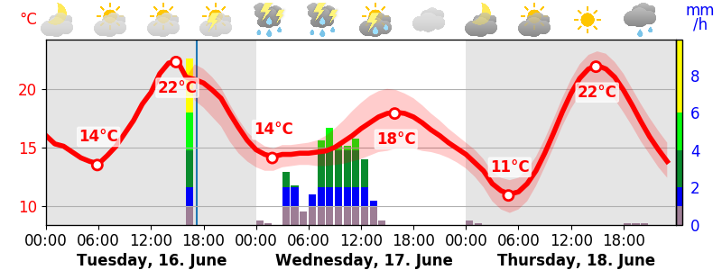

# MeteoSwiss-Forecast
Script to fetch the MeteoSwiss Weather Forecast data and generate a graph out of it.

The graph contains the rain and temperature forecast. later one is enhanced with the uncertainty band. Additionally, a blue marker indicates the last forecast model simulation.

The graph is highly configurable, how ever in the default configuration it tries to adapt the style of the MeteoSwiss App.

### Default
`python3 meteoswissForecast.py -z 8001 -f myForecast.png -m meta.json`


### Enhancements
Additionally, you can switch to a dark mode, change the time divisions, select the number of days and even mark the min/max temperature per day.

#### Example 1
`python3 meteoswissForecast.py -z 6986 -f myForecast.png -m meta.json --days-to-show 3 --width 800 --symbol-division 2 --min-max-temperature`



#### Example 2
`python3 meteoswissForecast.py -z 8001 -f myForecast.png -m meta.json --days-to-show 3 --time-division 2 --width 1200 --height 300 --min-max-temperature --dark-mode --locale de_DE.utf8 --date-format="%A, %-d. %b" --time-format="%H"`


### Marking of Current time
The repo contains an extra script to add a mark of the current time (red bar). One might want to update this every minute or so.
Since the generation of the forecast is rater slow, one might want to only update the current time mark at a high frequency but only generate the forecast once every hour.

`python3 markGraphic.py -i myForecast.png -o myForecast-marked.png -x 52 -y 50 -w 295 -H 161`


## Preparations
### Requirements
Run `python3 -m pip install -r requirements.txt` to install all needed Python packages.

### Get Symbols
The icons are not provided in this repo for legal reasons. But they can be fetched with the below script.
MeteoSwiss provides the symbols as SVG files. How ever we need them as PNG files, preferably with a transparent background.
Following script needs to be run once to fetch and convert all icons:
```
BASE_URL="https://www.meteoschweiz.admin.ch/etc.clientlibs/internet/clientlibs/meteoswiss/resources/assets/images/icons/meteo/weather-symbols"
mkdir symbols
cd symbols
for i in {1..50}; do wget "$BASE_URL/$i.svg"; done
for i in {101..150}; do wget "$BASE_URL/$i.svg"; done
for f in *.svg; do convert -background transparent -resize 256x256 -density 500 $f ${f%.svg}.png; done
rm *.svg
```

## Notes
The scripts use the timezone of `Europe/Zurich` and take the daylight saving into consideration. If this does not work for you, use the `utc-offset` parameter for an override.


# Docker
## Build it
`docker build -t meteoswiss-forecast .`

## Run it in a Docker Container
1. Adjust the parameters in `Dockerfile`
1. Build the docker image with `docker build -t meteoswiss-forecast .`
1. Run it with `docker run -it --rm -v /volume1/web/MeteoSwiss-Forecast:/data --name my-meteoswiss-forecast -p 12080:80 --label=com.centurylinklabs.watchtower.enable=false meteoswiss-forecast`
1. Call it in a webbrowser: `http://localhost:12080`

## replace existing Docker Container (Update)
```
docker build -t meteoswiss-forecast .
docker stop meteoswiss-forecast
docker rm meteoswiss-forecast
docker run -d -P --name meteoswiss-forecast -p 12080:80 -v /volume1/web/MeteoSwiss-Forecast:/data --label=com.centurylinklabs.watchtower.enable=false meteoswiss-forecast
```


# Legal
The scripts only use publicly available data provided by the [website of MeteoSwiss](https://www.meteoschweiz.admin.ch/home.html?tab=overview). 

The scripts are provided under the terms of the GPL V3.

# TODO
 - Update Images in readme
 - Refactor code, split data extractor and plot generator code


 
# Internals
## Data Fetching Flow
As of Nov. 2022, the workflow and URLs changed:

### Get Overview Version
https://www.meteoschweiz.admin.ch/product/output/weather-pill/versions.json
```json
{"currentVersionDirectory":"version__20221116_0707"}
```

### Get Overview Data based on Zip code (contains city name)
https://www.meteoschweiz.admin.ch/product/output/weather-pill/version__20221116_0707/de/800100.json
```json
{"path":"/lokalprognose/zuerich/8001.html","temp_high":"13","name":"Zürich","temp_low":"8","weather_symbol_id":"3"}
```

 
## Fetch Forecast Data
### Get Forecast version
https://www.meteoschweiz.admin.ch/product/output/forecast-chart/versions.json
```json
{"currentVersionDirectory":"version__20221116_0709"}
```
 
### Get Forecast Data
https://www.meteoschweiz.admin.ch/product/output/forecast-chart/version__20221116_0709/de/800100.json
```
[{"max_date":1668636000000,"rainfall":[[1668553200000,0.2],[1668556800000,0.2],[1668560400000,1],[1668564000000,0.7],[1668567600000,0.2],[1668571200000,0],[1668574800000,0],[1668578400000,0],[1668582000000,0],[1668585600000,0],[1668589200000,0],[1668592800000,0],[1668596400000,0],[1668600000000,0],[1668603600000,0],[1668607200000,0],[1668610800000,0],[1668614400000,0],[1668618000000,0],[1668621600000,0],[1668625200000,0],[1668628800000,0],[1668632400000,0],[1668636000000,0]],"sunrise":1668580293000,"day_string":"Heute","sunshine":[[1668553200000,0],[1668556800000,0],[1668560400000,0],[1668564000000,0],[1668567600000,0],[1668571200000,0],[1668574800000,0],[1668578400000,0],[1668582000000,0],[1668585600000,0],[1668589200000,21],[1668592800000,36],[1668596400000,36],[1668600000000,37],[1668603600000,33],[1668607200000,2],[1668610800000,0],[1668614400000,0],
[..]
```
